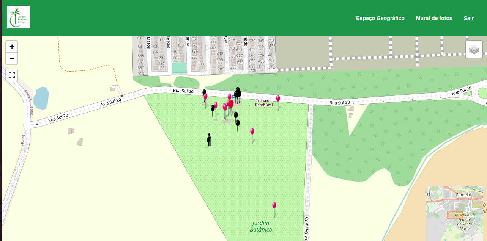

# Jardim Botânico UFSM

## Desenvolvedor(a)
Gabriele Soares Quevedo

## Bastidores
- Dificuldades com deploy
- Aprendizado com mapa
- Acesso aos dados
- Muitas libs ligado no Vue Leaflet

## Tecnologias
- Vue
- Vercel
- Naive Ui
- Node
- MongoDB

## Link de acesso
https://project4-gsquevedo.vercel.app/